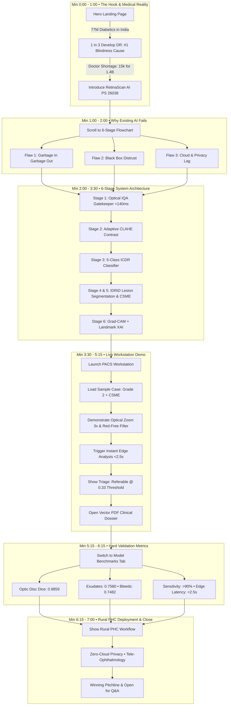

# 07. SIH 2026 Presentation Flow & Team Choreography Guide

> **Total Pitch Time**: 7 Minutes (420 Seconds)  
> **Target Audience**: SIH Technical Judges (Ophthalmologists, AI Researchers, Software Architects)  
> **Key Strategy**: Start with the brutal medical reality &rarr; expose flaws of existing AI &rarr; show the live 6-stage workstation &rarr; back it up with hard validation numbers &rarr; close with rural impact.

---

## 1. Master Presentation Flow Diagram (Mermaid)

---

## 2. Minute-by-Minute Team Choreography Table

| Time (Min) | Screen to Show | Speaker Action & Dialogue | Tech Driver (Laptop Actions) | Must-Mention Keywords |
| :--- | :--- | :--- | :--- | :--- |
| **0:00 - 1:00** | **Hero Section** (`/`) | **The Hook**: *"India is the diabetes capital of the world (77M patients). Early DR has zero symptoms. 15k doctors for 1.4B people. We built RetinaScan AI."* | Keep screen steady on clean Hero with eye video. | `77 Million Diabetics`, `Asymptomatic`, `15,000 Doctors`, `PS 26038`. |
| **1:00 - 2:00** | **Pipeline Flowchart** (`#pipeline-flowchart`) | **The Problem**: *"Why clinics reject basic AI: Garbage In Garbage Out on blurry camp photos, black-box distrust, and cloud privacy issues."* | Smooth scroll to 6-stage flowchart. | `Garbage In Garbage Out`, `Black Box`, `Zero Cloud Privacy`. |
| **2:00 - 3:30** | **Flowchart Stage Cards** (01 &rarr; 02 &rarr; 04 &rarr; 05) | **The Engine**: Explain IQA gatekeeper (<140ms blur reject), CLAHE rescue, ResNet 5-class staging, and IDRiD lesion masks. | Click on Stage 01 card, then Stage 02, then Stage 05 inspector. | `<140ms Gatekeeper`, `UNGRADEABLE`, `IDRiD Dataset`, `CSME Zone`. |
| **3:30 - 5:15** | **PACS Workstation** (`activeTab = workstation`) | **Live Demo**: Show doctor tools (zoom into 20µm microaneurysm, toggle green red-free filter), hit run analysis, review CSME alert & PDF report. | 1. Click "Launch Workstation". 2. Select `grade2_moderate_csme.png`. 3. Hit Zoom `+` twice. 4. Toggle "Red-Free". 5. Click "Run Screening". 6. Open Report Modal. | `PACS Inspection`, `Red-Free Filter`, `CSME Foveal Distance`, `0.33 Threshold`, `Signed PDF`. |
| **5:15 - 6:15** | **Validation Benchmarks** (`activeTab = benchmarks`) | **The Defense**: *"We don't use synthetic data. Real Indian eyes (IDRiD). Optic Disc Dice 0.9859, >90% sensitivity, sub-2.5s edge execution."* | Click **Model Benchmarks** in header. Scroll to quantitative metrics table. | `0.9859 Disc Dice`, `>90% Sensitivity`, `No Synthetic Data`, `<2.5s Edge CPU`. |
| **6:15 - 7:00** | **Closing / Landing Footer** | **The Impact**: *"A ₹1.5L portable camera + laptop in every PHC. Asha workers screen; district specialists treat. We are a 100x force multiplier."* | Scroll to bottom CTA / architecture overview. Stand up and face judges. | `Rural PHC Ready`, `100x Force Multiplier`, `Zero Blindness`. |

---

## 3. Team Role Division (3-Person Format)

If your team has **2 to 3 members**, split roles like this for maximum polish:

### Speaker 1: Clinical Problem & Impact Lead (Min 0:00 - 2:00 & Min 6:15 - 7:00)
- Opens the presentation with energy and urgency.
- Explains why DR is devastating India and why existing cloud AI fails.
- Delivers the closing pitchline and handles deployment/business questions.

### Speaker 2: AI & Clinical Tech Lead (Min 2:00 - 3:30 & Min 5:15 - 6:15)
- Explains the 6-stage architecture, IQA math, and PyTorch lesion segmentation.
- Defends the numbers: why threshold is 0.33, why Optic Disc Dice is 0.9859, and how CSME foveal distance is calculated.

### Driver / Navigator (Min 3:30 - 5:15)
- Operates the laptop with zero hesitation.
- Clicks buttons in exact sync with Speaker 2's words (when speaker says "zoom", driver clicks zoom; when speaker says "report", driver opens modal).

---

## 4. Golden Rules to Win SIH

1. **Never Call It a "Diagnosis"**: Always say *"Clinical Decision Support System (CDSS) for Screening and Triage"*. Medical judges love regulatory accuracy.
2. **Never Apologize for Technology**: If Wi-Fi fails or backend stumbles, immediately click the pre-loaded **Cohort Library** or switch to the **1080p Live Demo Video** right below the flowchart on the landing page.
3. **Hit the "0.33 Threshold" Point Hard**: Judges will ask about False Negatives. Mentioning that you intentionally calibrated the threshold from 0.50 down to 0.33 to achieve >90% clinical sensitivity is an instant score booster.
