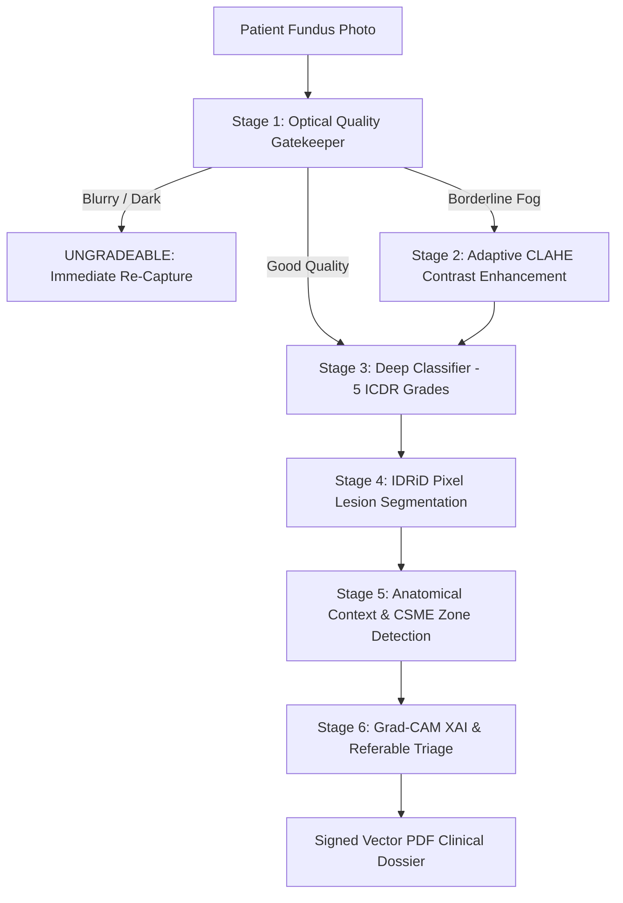

# RetinaScan AI — Complete System Architecture & Layman Guide

Welcome to the **RetinaScan AI** deep-dive documentation. This guide explains every component of our Diabetic Retinopathy (DR) autonomous screening system in simple, layman terms that anyone can understand, while preserving complete technical depth and medical accuracy.

---

## What Does This Project Do? (In Simple Words)
Imagine a small health clinic in a rural village with **no eye doctor (ophthalmologist)**. A diabetic patient walks in, and a community healthcare worker takes a simple photo of the back of their eye (a **retinal fundus photo**).

In under **2.5 seconds**, our AI system:
1. **Checks Quality**: Rejects blurry or dark photos immediately so the worker can retake it on the spot.
2. **Grades Disease**: Tells whether the patient has Diabetic Retinopathy and how severe it is (Grade 0 to Grade 4).
3. **Pinpoints Leaks**: Marks microscopic bleeding, lipid exudates, and swelling near central vision (CSME).
4. **Shows Proof (Explainable AI)**: Highlights exactly *where* in the eye the AI looked so a visiting doctor can verify it.
5. **Decides Triage**: Issues an immediate recommendation: *"Safe for routine 1-year checkup"* vs *"Urgent referral to eye hospital"*, and prints a signed PDF medical report.

---

## Master Table of Contents

| File | Topic | What It Explains |
| :--- | :--- | :--- |
| [01_FRONTEND.md](./01_FRONTEND.md) | **Frontend & Workstation UI** | Next.js 16, interactive PACS tools (zoom, pan, red-free filter), landing page visual pipeline, PDF export. |
| [02_BACKEND_API.md](./02_BACKEND_API.md) | **FastAPI Backend & Orchestration** | FastAPI routing, in-memory pipeline orchestration, asset caching, sub-2.5s edge execution. |
| [03_IMAGE_QUALITY_IQA.md](./03_IMAGE_QUALITY_IQA.md) | **Optical Quality Gatekeeper (IQA)** | Modified Laplacian blur detection, SNR illumination checks, CLAHE enhancement, preventing "Garbage In, Garbage Out". |
| [04_DR_CLASSIFIER_MODEL.md](./04_DR_CLASSIFIER_MODEL.md) | **5-Class Severity Classification** | EfficientNetB3/ResNet architecture, ICDR 5-tier grading, 0.33 calibrated referable threshold for >90% sensitivity. |
| [05_LESION_SEGMENTATION_MODELS.md](./05_LESION_SEGMENTATION_MODELS.md) | **IDRiD Pixel Lesion Models & CSME** | UNet/DeepLab PyTorch models for Optic Disc (0.985 Dice), Exudates, Hemorrhages, and macular distance math. |
| [06_EXPLAINABLE_AI_GRADCAM.md](./06_EXPLAINABLE_AI_GRADCAM.md) | **Explainable AI (Grad-CAM + Anatomy)** | Why heatmaps alone fail, anatomical landmark correlation with macula/disc, earning clinician trust. |

---

## The 6-Stage Clinical Screening Pipeline

---

## Key Numbers to Remember for Judges

- **Overall Edge Latency**: `< 2.5 seconds` on commodity CPU hardware.
- **IQA Gatekeeper Latency**: `< 140 ms`.
- **Referable DR Sensitivity**: `> 90%` (calibrated at `p >= 0.33` to prevent false negatives).
- **Optic Disc Segmentation Dice**: `0.9859` (IoU `0.9721`).
- **Hard Exudates Segmentation Dice**: `0.7580`.
- **Hemorrhages Segmentation Dice**: `0.7482`.
- **Training Datasets**: Real Indian cohort (**IDRiD** - Indian Diabetic Retinopathy Image Dataset) + **APTOS 2019** (Zero synthetic data).
