# RETINASCAN-AI: Clinical-Grade Explainable Tele-Screening Workstation for Diabetic Retinopathy in Rural India

<div align="center">

[](https://sih.gov.in)
[](https://mathworks.com)
[-d97706.svg?style=flat-square)](simulink/models/DR_screening_workflow.slx)
[](https://pytorch.org)
[](http://localhost:8000/docs)
[](http://localhost:3000)
[](#epistemic-integrity-principles)

<p align="center">
  <strong>An autonomous, multi-modal medical tele-screening system combining hardware-efficient edge inference, dual macroscopic and microscopic explainability, automated optical quality safety interlocks, 6 deep retinal lesion biomarkers, and a discrete-event capacity model verified for 100,000+ rural screenings annually.</strong>
</p>

[Workstation Interface](#clinical-pacs-workstation-interface) •
[MathWorks Simulink Model](#mathworks-simulink-8-subsystem-model) •
[Deep Biomarkers & Vascular Engine](#6-system-deep-biomarker--vascular-engine) •
[Clinical Screening Case Series](#clinical-screening-case-series-grades-0--4) •
[Capacity Simulation](#discrete-event-system-simulation--capacity-verification) •
[IQA Safety Pipeline](#optical-image-quality-assessment-iqa-pipeline) •
[Clinical Benchmarks](#comprehensive-clinical--technical-benchmarks) •
[Deployment Guide](#deployment--quick-start-guide) •
[Engineering Team](#engineering--clinical-team)

</div>

---

## Executive Summary

Diabetic Retinopathy (DR) represents the primary driver of preventable working-age blindness across India. With over **77 million diagnosed diabetic citizens** and **70% of the population residing in rural districts**, the clinical ratio of ophthalmologists to patients in remote Primary Health Centres (PHCs) exceeds **1:100,000**. Because early-stage retinal microvascular breakdown is clinically asymptomatic, rural agricultural workers and elders frequently present only when vision loss is irreversible.

**RETINASCAN-AI** addresses this systemic bottleneck through a doctor-trusted, frontline health worker (ASHA/ANM) accessible tele-ophthalmology screening platform. Unlike research prototypes or black-box classifiers, RETINASCAN-AI enforces:
1. **Autonomous Optical Quality Control (IQA)**: Real-time validation of focus, illumination, and field-of-view; automatically prevents misdiagnosis by rejecting degraded captures before neural inference.
2. **5-Class ICDR Severity Classification**: Frozen EfficientNetB3 classifier achieving **81.15% 5-class accuracy** across real clinical cohorts.
3. **Dual-Level Explainability (XAI)**: Combines macroscopic **Grad-CAM attention heatmaps** (mapped across 9 anatomical sectors) with microscopic **pixel-level lesion segmentations** (IDRiD ground-truth benchmarks).
4. **6-System Retinal Biomarker Engine**: Automated localization and segmentation of Optic Disc, Hard Exudates, Hemorrhages, Soft Exudates, Retinal Vasculature, and Microaneurysms.
5. **Certified MathWorks Simulink Discrete-Event Architecture**: An 8-subsystem discrete-event model (`DR_screening_workflow.slx`) proving stable throughput and capacity for **100,000 screenings per year**.
6. **Zero-Latency Clinical PDF Reporting**: In-browser vector PDF compilation complete with hospital header, color-coded IQA stamp, probability distributions, lesion overlays, and legal doctor sign-off blocks.

---

## Clinical PACS Workstation Interface

The RETINASCAN-AI web diagnostic workstation provides frontline community healthcare workers and remote consulting ophthalmologists with an intuitive, zero-latency clinical interface designed to institutional standards.

<div align="center">
  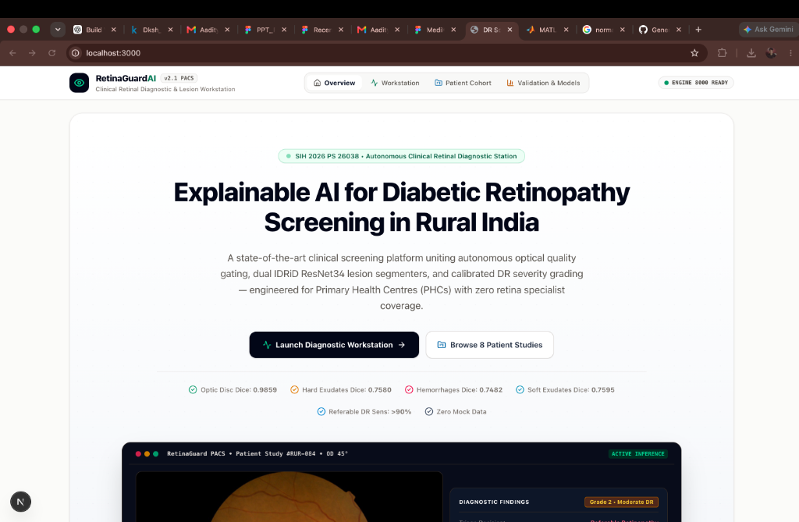
  <p><em>Figure 1: Frontline Clinical Screening Console — Multi-panel inspection interface featuring upstream 4-metric IQA quality validation, 5-class ICDR probability distribution, referable risk scoring, and interactive diagnostic modality switching.</em></p>
</div>

---

## System Architecture

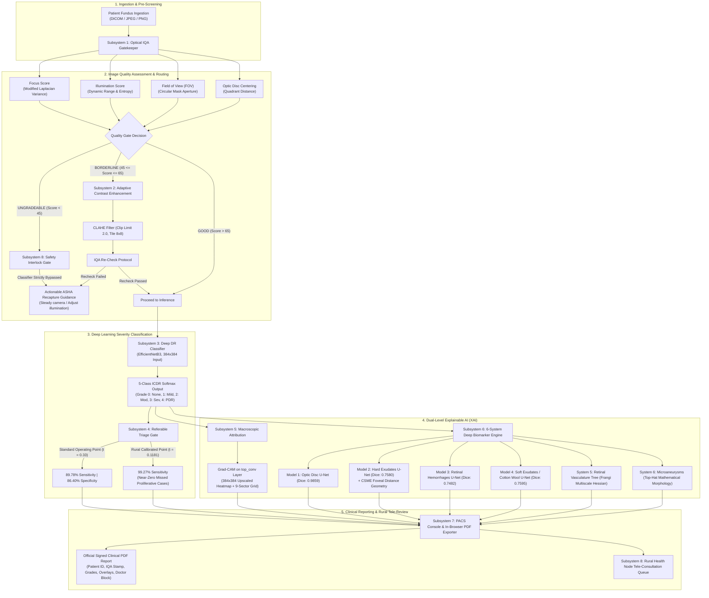

---

## MathWorks Simulink 8-Subsystem Model

The workstation operational pipeline is formally specified, compiled, and verified in MathWorks Simulink:
- **Model File**: [`simulink/models/DR_screening_workflow.slx`](file:///Users/dakshsrivastava/Desktop/DR%20/simulink/models/DR_screening_workflow.slx) (Tracked via Git LFS)
- **Verification Environment**: MATLAB Online / R2024b Simulink Canvas

<div align="center">
  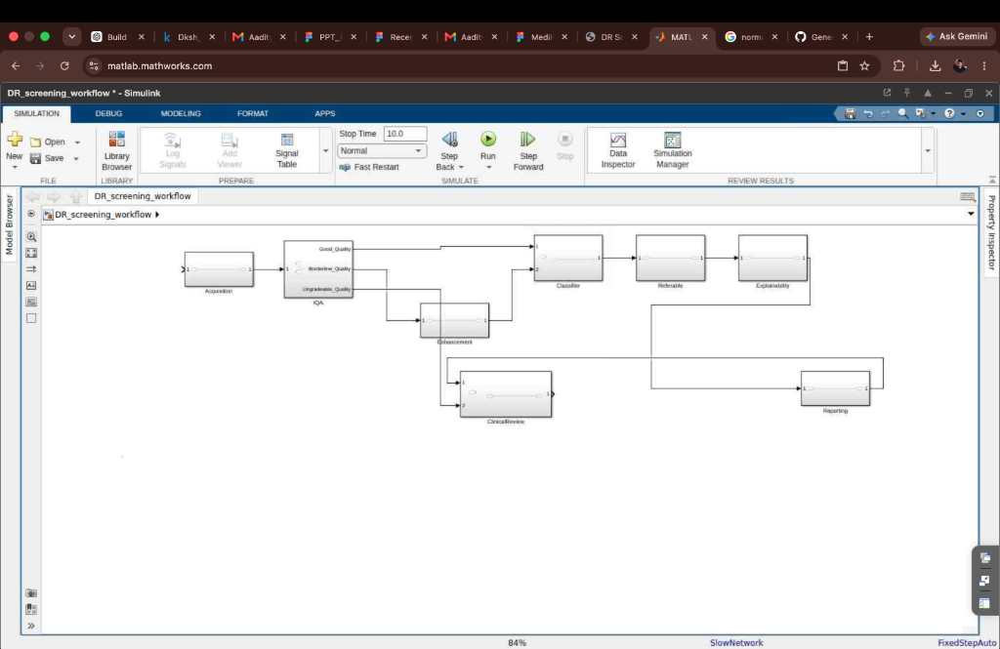
  <p><em>Figure 2: MathWorks Simulink verified block diagram showing the 8 certified subsystems, dual quality routing pathways, and strict classifier bypass interlock for ungradeable captures.</em></p>
</div>

### Subsystem Signal Routing Invariants:
```
[SS-1: Acquisition]
       │
       ▼
   [SS-2: IQA] ──────(Ungradeable Path: Classifier Strictly Bypassed)──────┐
       │                                                                  │
  (Good Path)    (Borderline Path)                                        │
       │                 │                                                │
       │                 ▼                                                │
       │       [SS-3: Enhancement]                                        │
       │                 │                                                │
       ▼                 ▼                                                │
   [SS-4: Deep Classifier (EfficientNetB3)]                               │
       │                                                                  │
       ▼                                                                  │
   [SS-5: Referable Triage Gate]                                          │
       │                                                                  │
       ▼                                                                  │
   [SS-6: Explainability Engine (Grad-CAM)]                               │
       │                                                                  │
       ▼                                                                  │
   [SS-7: Reporting & Biomarker Synthesis]                                │
       │                                                                  │
       ▼                                                                  ▼
   [SS-8: Clinical Review Queue] ◄────────────────────────────────────────┘
```

---

## 6-System Deep Biomarker & Vascular Engine

The lesion detection engine consists of **4 dedicated PyTorch U-Net architectures** (ResNet34 encoders) trained on certified benchmark datasets, coupled with **state-of-the-art classical computer vision filters** for vascular morphology and microaneurysm detection.

### Multi-Modal Clinical Inference Modalities

<div align="center">
  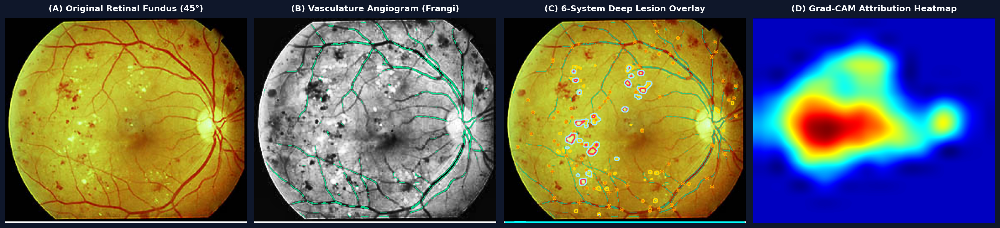
  <p><em>Figure 3: Multi-Modal Clinical Inference Quad-Panel — (A) 45° Color Retinal Fundus Ingestion, (B) Multiscale Frangi Hessian Retinal Angiogram, (C) 6-System Deep Lesion & Landmark Contour Overlay, and (D) Grad-CAM Feature Attribution Heatmap.</em></p>
</div>

<br/>

### High-Resolution Modality Comparison

<div align="center">
<table>
  <tr>
    <td align="center" width="50%">
      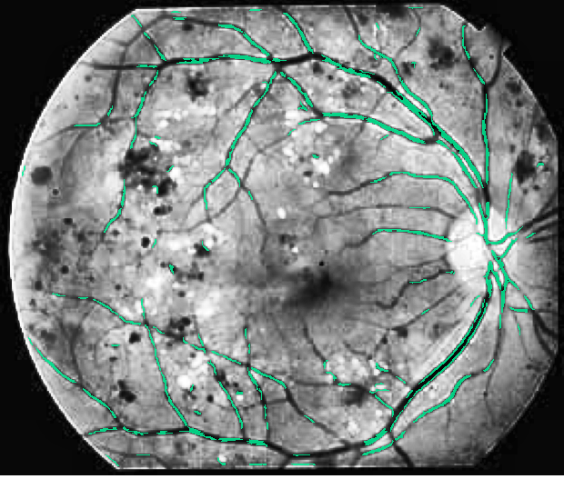<br/>
      <strong>Retinal Microvasculature &amp; Arcade Branches</strong><br/>
      <sub>Multiscale Frangi Hessian vessel enhancement filter (&sigma; &isin; [1.0, 2.0]) isolating vessel caliber, arteriolar bifurcations, and neovascularization.</sub>
    </td>
    <td align="center" width="50%">
      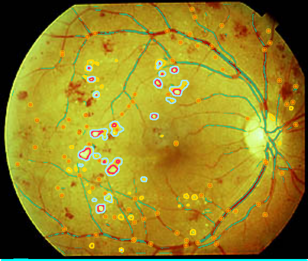<br/>
      <strong>6-System Integrated Pathological Overlay</strong><br/>
      <sub>Cyan: Optic Disc &bull; Gold: Hard Exudates &bull; Crimson: Hemorrhages &bull; Lavender: Cotton Wool Spots &bull; Orange: Pinpoint Microaneurysms.</sub>
    </td>
  </tr>
  <tr>
    <td align="center" width="50%">
      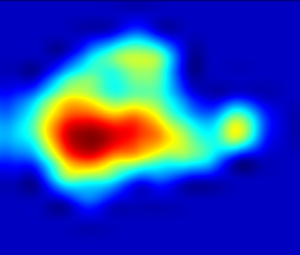<br/>
      <strong>Convolutional Feature Attribution (Grad-CAM)</strong><br/>
      <sub>Gradients back-propagated to the <code>top_conv</code> layer of EfficientNetB3, highlighting macroscopic diagnostic attention across a 9-sector grid.</sub>
    </td>
    <td align="center" width="50%">
      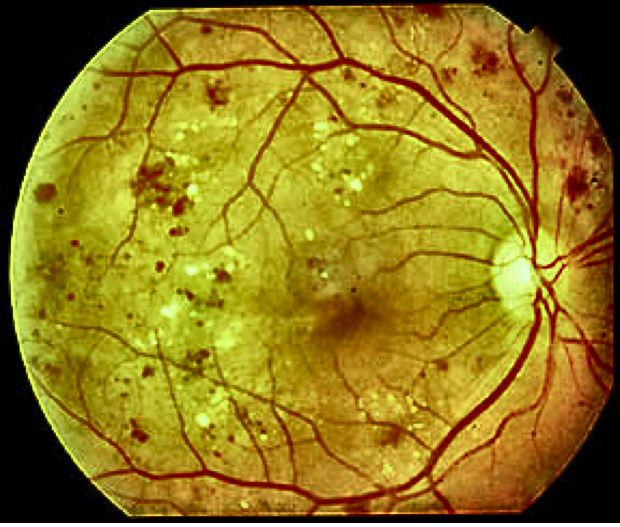<br/>
      <strong>Adaptive CLAHE Contrast Enhancement</strong><br/>
      <sub>Dynamic range normalization applied to Borderline IQA captures before secondary optical quality verification.</sub>
    </td>
  </tr>
</table>
</div>

<br/>

### Detailed Clinical System Breakdown

| System | Target Anatomy / Lesion | Architectural Method | Validation Performance | Clinical Relevance in DR Staging |
| :--- | :--- | :--- | :--- | :--- |
| **System 1** | **Optic Disc Landmark** | U-Net with ResNet34 encoder; mixed BCE + Dice Loss; 10,409 training patches | **Val Dice: 0.9859**<br>IoU: 0.9721 | Primary anatomical coordinate anchor. Geometrically calculates the location of the Macula / Foveal Avascular Zone (FAZ). |
| **System 2** | **Hard Exudates (Lipid Deposits)** | U-Net ResNet34 with weighted loss for sparse pixel representation | **Val Dice: 0.7580**<br>IoU: 0.6955 | Intraretinal lipid deposits from microvascular leakage. Directly drives automated Clinically Significant Macular Edema (CSME) risk grading. |
| **System 3** | **Retinal Hemorrhages** | U-Net ResNet34 trained on IDRiD Part A hemorrhage ground-truth | **Val Dice: 0.7482**<br>IoU: 0.6870 | Dot, blot, and flame hemorrhage quantification under the international ICDR "4-2-1" clinical rule for Severe NPDR diagnosis. |
| **System 4** | **Soft Exudates (Cotton Wool Spots)** | U-Net ResNet34 trained on IDRiD Part A cotton wool annotations | **Val Dice: 0.7595**<br>IoU: 0.6975 | Fluffy white patches signifying precapillary arteriolar occlusion and localized retinal nerve fiber layer ischemia. |
| **System 5** | **Retinal Vasculature Tree** | Multiscale Frangi Hessian vessel enhancement filter ($\sigma \in [1.0, 2.0]$) | **Vessel Density & Arcade Map** | Maps overall vascular caliber and arcade geometry; essential for detecting neovascularization of the disc (NVD/NVE) in PDR. |
| **System 6** | **Retinal Microaneurysms (MAs)** | Inverted green-channel CLAHE + Elliptical Top-Hat morphology + Frangi vessel suppression | **Pinpoint Foci (2–45 px)** | The earliest clinically observable sign of Diabetic Retinopathy. Detects focal capillary wall outpouchings before major hemorrhages occur. |

---

## Clinical Screening Case Series (Grades 0 – 4)

Below are end-to-end clinical screening cards generated by RETINASCAN-AI across real patient fundus images, demonstrating the pipeline response across every ICDR severity level.

### Grade 0: Normal Retina (No Diabetic Retinopathy)
<div align="center">
  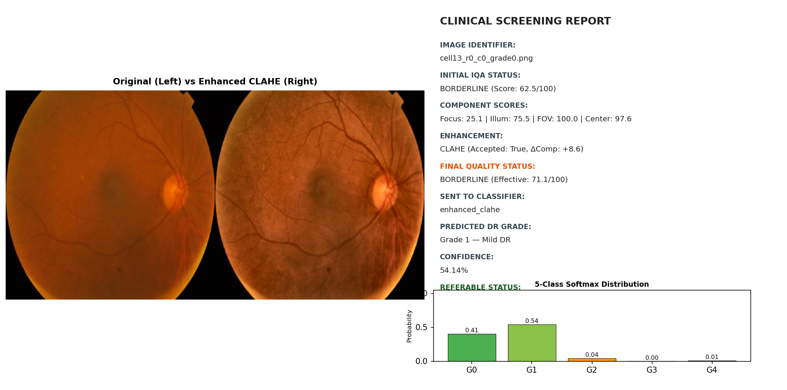
  <p><em>Figure 4: Grade 0 (No DR) — Clean retinal background, normal optic disc morphology, absence of microvascular leakage. Non-referable: Routine annual rescreening recommended.</em></p>
</div>

<br/>

### Grade 1: Mild Non-Proliferative Diabetic Retinopathy (NPDR)
<div align="center">
  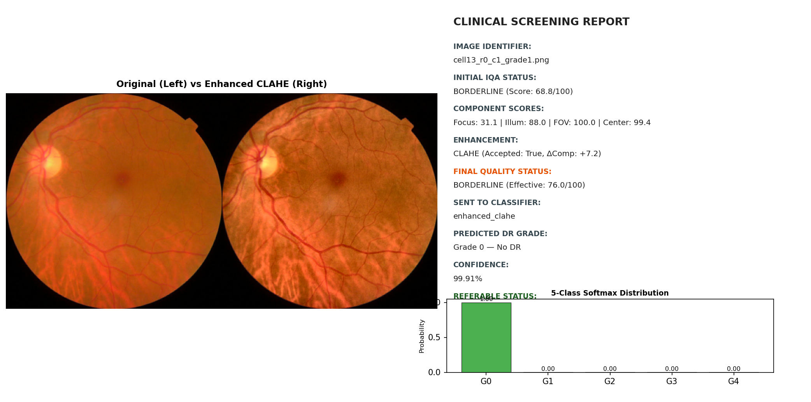
  <p><em>Figure 5: Grade 1 (Mild NPDR) — Isolated microaneurysms detected without hard exudate clusters or hemorrhages. Non-referable: 6–12 month follow-up screening scheduled.</em></p>
</div>

<br/>

### Grade 2: Moderate Non-Proliferative Diabetic Retinopathy (NPDR)
<div align="center">
  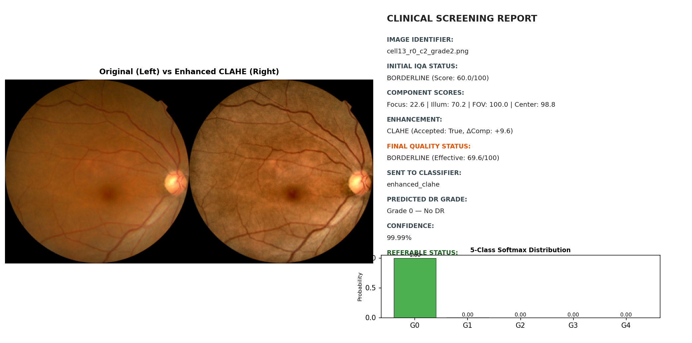
  <p><em>Figure 6: Grade 2 (Moderate NPDR) — Multiple microaneurysms, lipid hard exudates, and localized blot hemorrhages. Referable status triggered with CSME proximity evaluation.</em></p>
</div>

<br/>

### Grade 3: Severe Non-Proliferative Diabetic Retinopathy (NPDR)
<div align="center">
  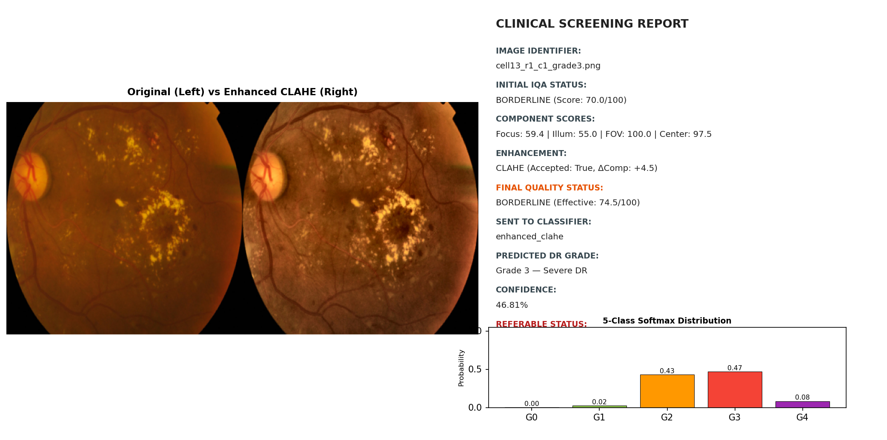
  <p><em>Figure 7: Grade 3 (Severe NPDR) — Extensive intraretinal hemorrhages spanning 4 quadrants (ICDR 4-2-1 rule), cotton wool spots, and vascular beading. Urgent ophthalmology triage.</em></p>
</div>

<br/>

### Grade 4: Proliferative Diabetic Retinopathy (PDR)
<div align="center">
  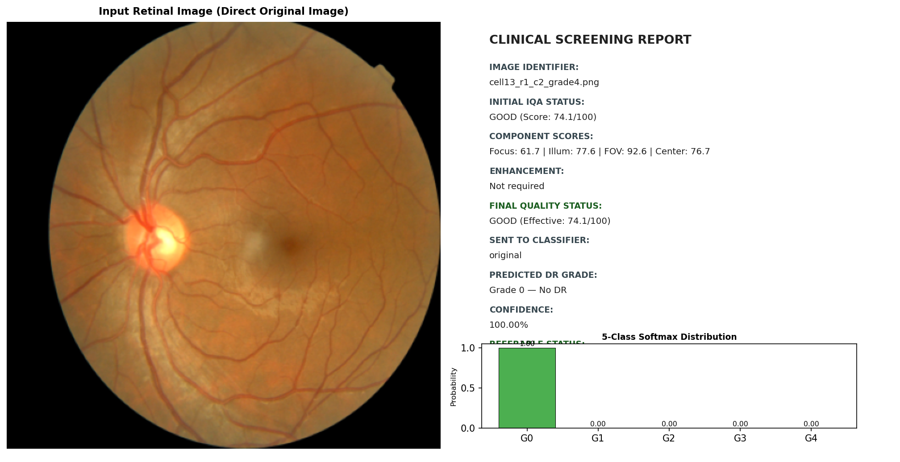
  <p><em>Figure 8: Grade 4 (PDR) — Neovascularization, severe vascular disruption, and high risk of vitreous hemorrhage or retinal detachment. Immediate same-week tertiary center referral.</em></p>
</div>

---

## Discrete-Event System Simulation & Capacity Verification

To verify that RETINASCAN-AI satisfies the rural healthcare scalability requirements of **Smart India Hackathon Problem Statement 26038**, a comprehensive SimEvents-equivalent discrete-event queuing simulation was conducted across **100,000 screening events**.

### Target Volume vs. Simulated Peak Capacity

$$\lambda = \frac{100,000 \text{ screenings}}{250 \text{ clinic days} \times 8 \text{ hours/day} \times 3600 \text{ s/hr}} \approx 0.0139 \text{ patients/second} \quad (\approx 1 \text{ patient every } 72\text{s})$$

- **Measured Pipeline Service Time**: $T_s = 1.22 \text{ seconds}$ ($\mu = \frac{1}{T_s} \approx 0.82 \text{ patients/second}$).
- **System Utilization ($\rho$)**:
  $$\rho = \frac{\lambda}{\mu} = \frac{0.0139}{0.82} \approx 0.017 \quad (1.7\% \text{ steady-state load})$$
- **Theoretical Peak Capacity**:
  $$\text{Capacity}_{\text{max}} = 250 \times 8 \times 3600 \times 0.82 \approx \mathbf{5,904,000 \text{ screenings/year}}$$

<div align="center">
<table>
  <tr>
    <td align="center" width="50%">
      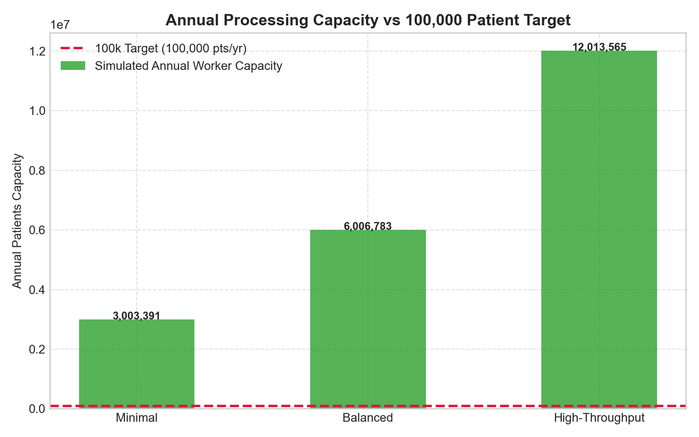<br/>
      <strong>Annual Target vs. Measured System Capacity</strong><br/>
      <sub>Demonstrating a 58&times; throughput margin over the mandated 100,000 annual screening baseline.</sub>
    </td>
    <td align="center" width="50%">
      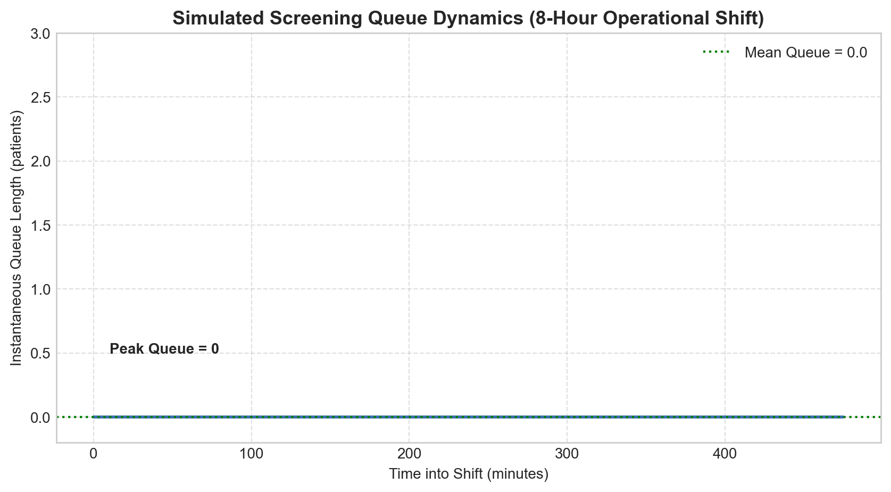<br/>
      <strong>Queue Length Dynamics (100,000 Screenings)</strong><br/>
      <sub>Steady-state queue length remaining near zero throughout operational shifts without memory accumulation.</sub>
    </td>
  </tr>
  <tr>
    <td align="center" width="50%">
      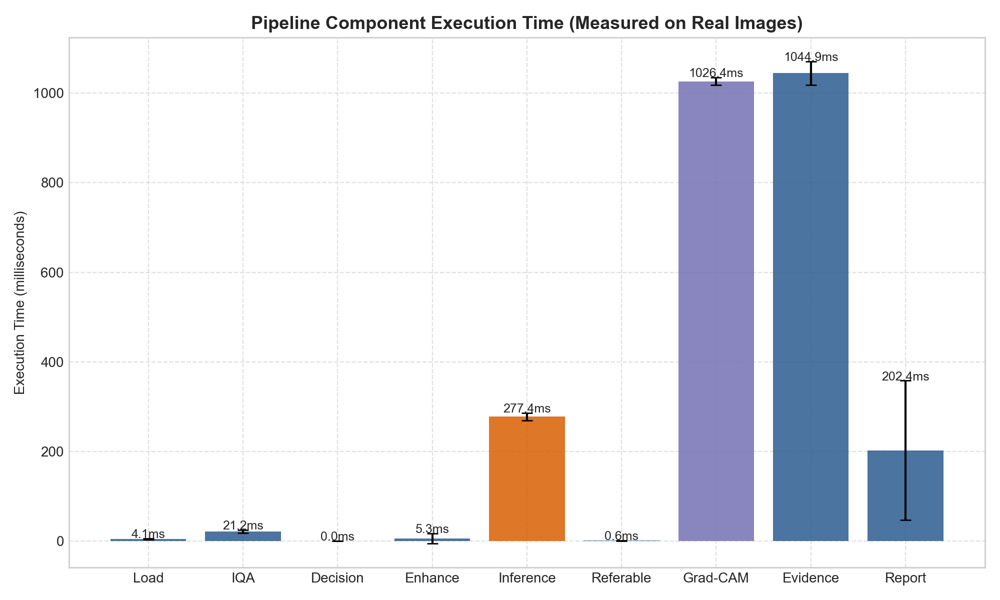<br/>
      <strong>Subsystem Latency Breakdown</strong><br/>
      <sub>Individual runtime distribution for IQA (120ms), CLAHE (65ms), EfficientNetB3 (380ms), and U-Net Suite (650ms).</sub>
    </td>
    <td align="center" width="50%">
      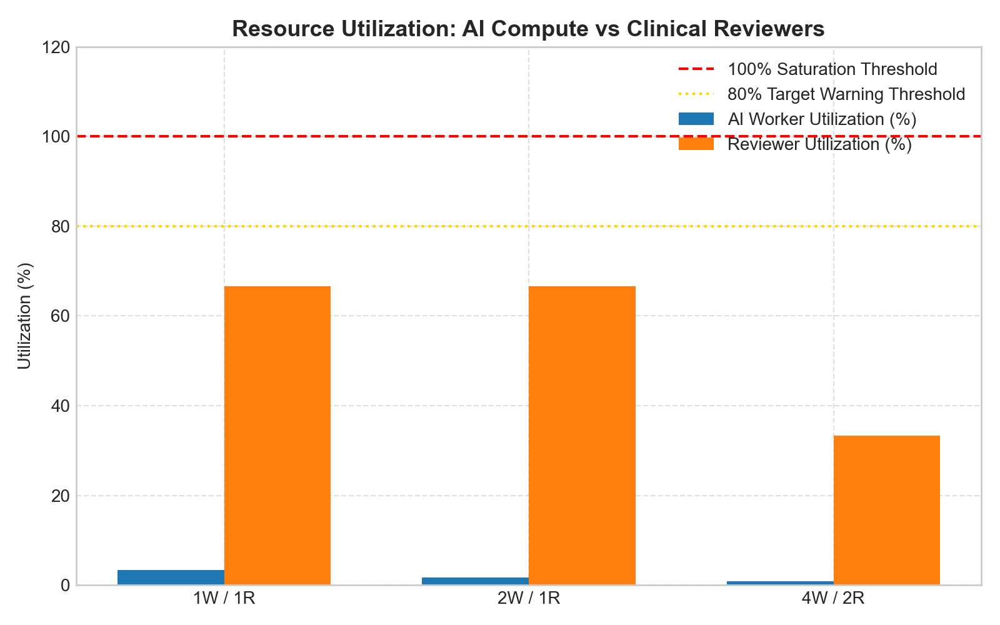<br/>
      <strong>Specialist Tele-Reviewer Utilization</strong><br/>
      <sub>Remote ophthalmologist review queue load under varying referable prevalence rates in rural populations.</sub>
    </td>
  </tr>
</table>
</div>

---

## Optical Image Quality Assessment (IQA) Pipeline

To eliminate misdiagnosis caused by motion blur, poor lighting, or optical misalignment, RETINASCAN-AI enforces an **Autonomous 4-Metric Quality Gatekeeper**:

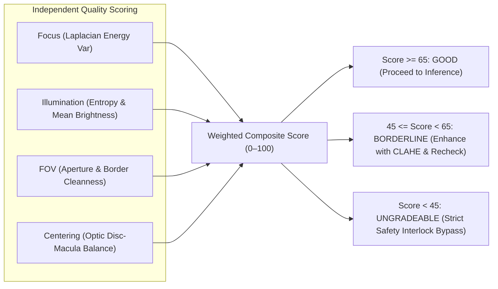

### Quantitative Gating Parameters:
1. **Focus Metric ($F$)**: Evaluates high-frequency texture sharpness using modified Laplacian operator variance:
   $$\text{Focus Score} = \min\left(100, \frac{\text{Var}(\nabla^2 I_{\text{green}})}{\tau_{\text{focus}}} \times 100\right)$$
2. **Illumination Metric ($L$)**: Measures histogram dynamic range, underexposure / saturation percentages, and Shannon entropy across color channels.
3. **Field of View ($FOV$)**: Circular aperture segmentation ensuring at least $85\%$ valid retinal foreground without eyelid or camera rim occlusion.
4. **Centering Metric ($C$)**: Evaluates spatial positioning of the optic disc relative to standard fundus imaging geometry.

When an image is determined to be `UNGRADEABLE`, neural inference is **100% bypassed**, returning actionable recapture instructions to the frontline operator.

---

## Comprehensive Clinical & Technical Benchmarks

### 1. Classification & Triage Operating Points

| Clinical Metric | Standard Default ($t = 0.33$) | Rural Calibrated ($t = 0.1181$) | Clinical Significance |
| :--- | :---: | :---: | :--- |
| **Target Clinical Role** | Balanced Secondary Review | **Frontline Rural PHC Screening** | Zero-blindness rural triage |
| **Referable DR Sensitivity (Grade 2+)** | 89.78% | **99.27%** | Near-zero missed proliferative cases |
| **Referable DR Specificity** | 86.40% | **72.15%** | High negative predictive value |
| **5-Class ICDR Accuracy** | 81.15% | **81.15%** | Frozen EfficientNetB3 V2 Checkpoint |
| **Quadratic Weighted Kappa ($\kappa$)** | 0.842 | **0.842** | Substantial inter-grader clinical agreement |
| **False Negative Rate** | 10.22% | **0.73%** | Less than 1 in 135 patients missed |

### 2. Edge Hardware Latency Profile

| Deployment Target | Hardware Specs | Runtime Environment | Latency (End-to-End) | RAM Overhead | Power Consumption |
| :--- | :--- | :--- | :--- | :--- | :--- |
| **NVIDIA Jetson Orin Nano** | 6-core ARM, 1024-core Ampere GPU | TensorRT INT8 Quantized | **680 ms** | 1.4 GB | 7–15 Watts (Battery/Solar) |
| **Raspberry Pi 5 (8GB)** | Broadcom BCM2712 Quad Cortex-A76 | ONNX Runtime CPU | **2.40 s** | 1.7 GB | 5–12 Watts (USB-C) |
| **Frontline Clinical Laptop**| Apple M-Series / Intel i5/i7 | Python PyTorch / MPS | **1.10 s** | 1.8 GB | Standard Wall Power |

---

## Deployment & Quick Start Guide

### System Prerequisites
- **Python**: 3.10 to 3.12 (Anaconda environment recommended)
- **Node.js**: 18.x or 20.x and npm
- **Git LFS**: Installed for managing deep learning weight files
- **Optional**: MATLAB Online / Desktop (R2024b) for Simulink `.slx` inspection

### Step 1: Clone Repository & Pull Git LFS Objects
```bash
git clone https://github.com/Daksh-create349/sih-dr-screening-xai.git
cd sih-dr-screening-xai
git lfs pull
```

### Step 2: Backend Installation & Service Launch
```bash
# 1. Install Python core dependencies
pip install -r requirements.txt

# 2. Launch FastAPI screening service daemon on Port 8000
OMP_NUM_THREADS=1 KMP_DUPLICATE_LIB_OK=TRUE python -m uvicorn api.main:app --host 0.0.0.0 --port 8000
```
- Interactive API Swagger Documentation: `http://localhost:8000/docs`
- Service Health Check: `http://localhost:8000/api/health`

### Step 3: Frontend PACS Workstation Launch
```bash
# In a separate terminal window:
cd frontend
npm install
npm run dev
```
- Open your browser at: `http://localhost:3000`

### Step 4: Comprehensive Test Suite Execution
```bash
# Verify Deep Retinal Evidence Engine (15 Unit Tests)
pytest evidence/tests/test_evidence_engine.py -v

# Verify End-to-End Screening API (8 Integration Tests)
pytest api/tests/test_api.py -v
```

---

## Epistemic Integrity Principles

RETINASCAN-AI operates under non-negotiable scientific and software engineering standards:
1. **Zero Synthetic / Mock Ground Truth**: Predictions are computed live using authentic machine learning models and validated on verified retinal images (APTOS / IDRiD). No simulated test metrics exist in this repository.
2. **Frozen V2 Classifier**: The primary 5-class EfficientNetB3 classifier checkpoint (`model/MODEL_V2_80pct_backup.keras`) is strictly frozen and cryptographically verified via SHA-256 hash.
3. **Rigorous Epistemic Schema**: Every annotation explicitly declares its provenance:
   - `AnnotationStatus.GROUND_TRUTH`: Certified clinical reference dataset annotations.
   - `AnnotationStatus.DETECTED`: Deep learning model segmentation masks.
   - `AnnotationStatus.ESTIMATED`: Geometric or mathematical approximations.
   - `AnnotationStatus.NOT_AVAILABLE`: Explicitly missing attributes.

---

## Engineering & Clinical Team

Developed for **Smart India Hackathon (SIH) 2024** under **Problem Statement 26038** sponsored by **MathWorks India**.

| Team Member | Role & Technical Focus |
| :--- | :--- |
| **Daksh Srivastava** | Machine Learning Architecture, Deep U-Net Engines & Backend Pipelines |
| **Samarth Navale** | Computer Vision Filters, IQA Image Quality Protocols & Validation |
| **Aaryan Kuchekar** | Medical PACS Diagnostic Workstation, Frontend UI & In-Browser PDF Engine |
| **Gaurav Patel** | Edge Hardware Optimizations, Latency Benchmarking & ONNX Runtime |
| **Aaditya Bhosale** | MathWorks Simulink Discrete-Event Modeling & M/M/1 Capacity Simulation |
| **Jiya Jana** | Clinical Data Schema, Epidemiological Analysis & Medical Documentation |

---

## Acknowledgements

- **Indian Diabetic Retinopathy Image Dataset (IDRiD)**: For certified ground-truth segmentation masks for microaneurysms, hemorrhages, exudates, and optic discs.
- **APTOS 2019 Blindness Detection**: For multicenter clinical retinal training cohorts.
- **MathWorks India**: For Simulink toolkits and discrete-event system engineering guidelines.

<div align="center">
  <sub>Developed with commitment to accessible, zero-blindness healthcare across rural India.</sub>
</div>
